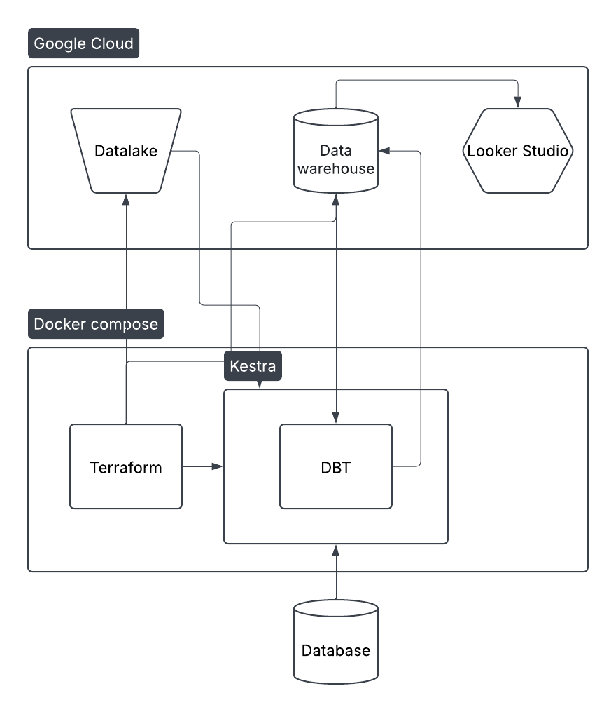
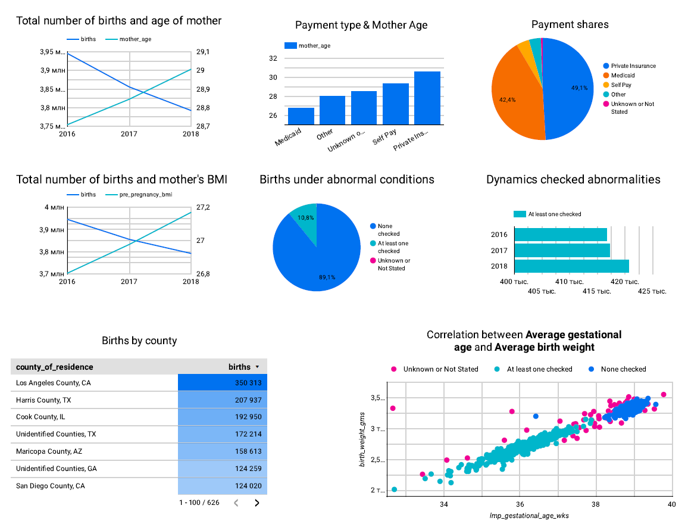
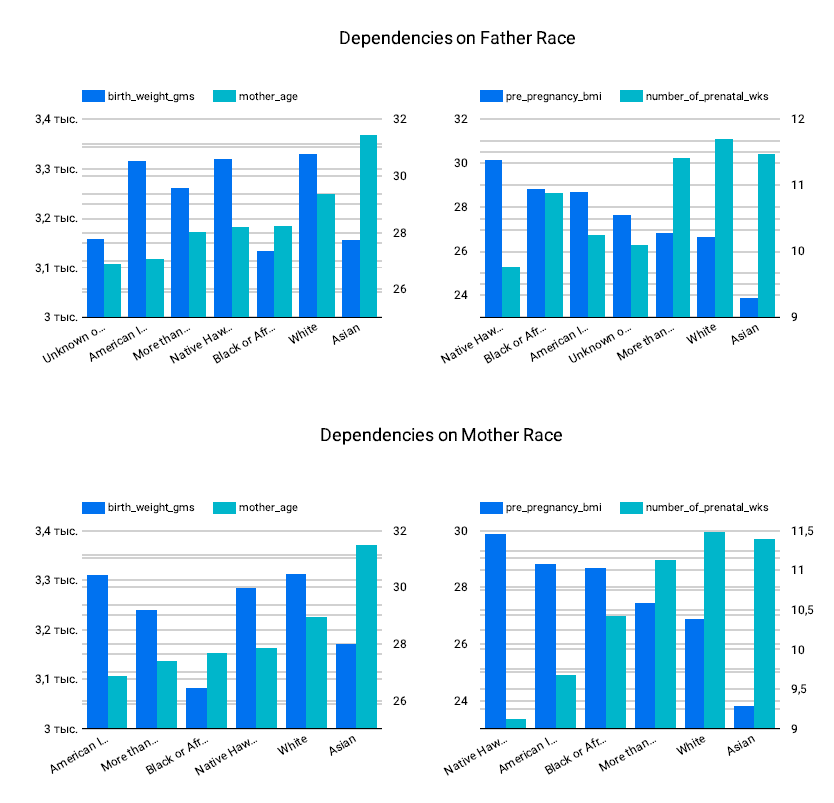

# USA Birth Rate Data Engineering Project

### Table of Contents
- [Overview](#overview)
- [Technical Requirements](#technical-requirements)
- [Deployment Architecture](#deployment-architecture)
- [Deployment Guide](#deployment-guide)
- [Dashboard Visualization](#dashboard-visualization)

## Overview

For the final project in the data engineering course, I am using the [<b>USA Birth Rate (2016-2018)</b>](https://console.cloud.google.com/marketplace/product/center-disease-control/wonder-births?hl=ru&inv=1&invt=Abs1rg) dataset from Kaggle. Here's a brief overview of its features and what I am doing with it:

### Dataset Features
- Timeframe: The dataset covers birth rates in the USA from 2016 to 2018.
- Geographical Granularity: It includes data at the state and county levels, allowing for detailed regional analysis.
- Demographic Insights: The dataset provides information on birth rates across different demographic groups, such as age, race, and ethnicity.
- Key Metrics: It includes metrics like the number of births, fertility rates, and population data.

### What I Am Doing with It
- Data Ingestion: I am ingesting the dataset into a cloud storage solution (e.g., Google Cloud Storage) using Terraform for infrastructure automation.
- Data Transformation: Using dbt (Data Build Tool), I am cleaning and transforming the data to create structured tables for analysis.
- Orchestration: I am using Kestra to orchestrate the entire pipeline, ensuring that data ingestion, transformation, and loading happen in a coordinated manner.
- Visualization: Finally, I am creating interactive dashboards (e.g., using Looker Studio) to visualize trends in birth rates across different states and demographic groups.

This project demonstrates end-to-end data engineering skills, from infrastructure setup to data transformation and visualization. 

## Technical Requirements

- Git
- Google Cloud Platform Account
    - Empty project and credentials for this project
- Docker

## Deployment Architecture

The whole architecture is shown in the picture below:


## Deployment Guide

For the beginning run
```bash
$ git clone https://github.com/IuliiaKameneva/zoomcamp2025.git
$ cd zoomcamp2025/Project/
$ mkdir essential_data
```
Put into the folder `essential_data` json-file with google account credentials. Then run
```
$ bash env_script.sh essential_data/google-credentials.json
```
Add your project_id in file `variables.tf` in the variable `project`. Run
```
$ docker-compose up
```
This Docker Compose file is responsible for the complete deployment of the project: Terraform creates all the necessary infrastructure (provisioning cloud resources such as buckets and databases, and creating flows for Kestra).

After a message like
```terraform-1  | Apply complete! Resources: 8 added, 0 changed, 0 destroyed.```

go to:
[http://localhost:8080/ui/flows/edit/final_project/bigquery_extraction_flow](http://localhost:8080/ui/flows/edit/final_project/bigquery_extraction_flow)
click `Execute` and choose `Debug` in `dbt_command` and again `Execute`.
This execution downloads dbt-scenarios for our data and debugs it. 

When the flow run succesfully, execute it one more time, but without changings variables (just click `Execute` and confirm it). 

It's the main execution. By trigger it will execute every month, but you need to run it for the first time. This flow does all pipeline with the dataset:
- extract_data_from_bigquery: extracts all tables of the dataset
- convert_data_to_csv: converts the tables in csv format
- upload_to_gcs: saves the tables in the Google bucket
- create_external_table: creates the external tables for further processing 
- runs dbt for data processing

## Dashboard Visualization
After successfull flow execution you can visualize the data like in the report [https://lookerstudio.google.com/reporting/b6746fc0-fd70-4e38-88fa-a4ba20d15288](https://lookerstudio.google.com/reporting/b6746fc0-fd70-4e38-88fa-a4ba20d15288)

It can looks like



This report uses the pivot tables are generated with dbt and updates automatically.