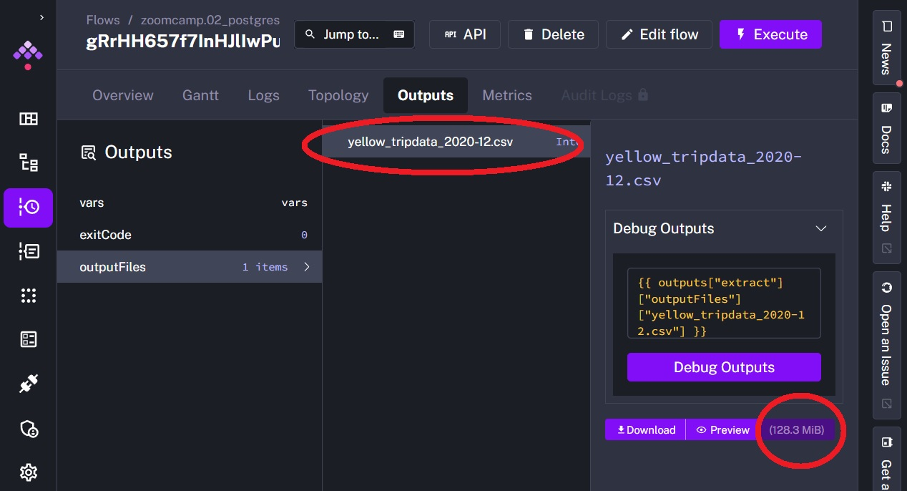
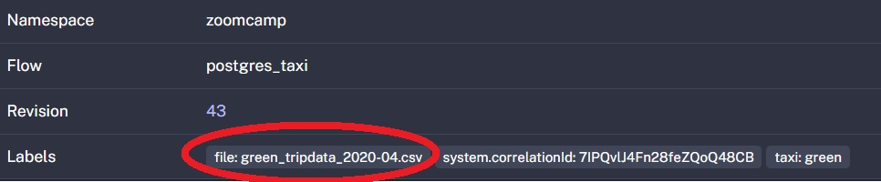

# Homework 2: Workflow Orchestration

## Question 1
Within the execution for Yellow Taxi data for the year 2020 and month 12: what is the uncompressed file size (i.e. the output file yellow_tripdata_2020-12.csv of the extract task)?
- 128.3 MB
- 134.5 MB
- 364.7 MB
- 692.6 MB

### Solution
We can find the nessesary info in outputs after running the flow (f.e. 02_postgres_taxi_scheduled) in Kestra.


So, the right answer is
- 128.3 MB

## Question 2
What is the rendered value of the variable file when the inputs taxi is set to green, year is set to 2020, and month is set to 04 during execution?
- {{inputs.taxi}}_tripdata_{{inputs.year}}-{{inputs.month}}.csv
- green_tripdata_2020-04.csv
- green_tripdata_04_2020.csv
- green_tripdata_2020.csv

### Solution
During execution the flow uses inputs data to render values of variables. Thus, the rendered value of the variable file when the inputs taxi is set to green, year is set to 2020, and month is set to 04 must be respectively `green_tripdata_2020-04.csv`



## Question 3
How many rows are there for the Yellow Taxi data for all CSV files in the year 2020?
- 13,537.299
- 24,648,499
- 18,324,219
- 29,430,127

### Solution
If you ingest in the table `yellow_trip_data` on your GCP with help of Kestra just data for 2020 year, you can use the simple request
```sql
SELECT count(*) FROM `fair-canto-447119-p5.zoomcamp.yellow_tripdata` 
```
otherwise, if your table `yellow_trip_data`has data from other timeperiods too, you can use the follow request for each table per month
```sql
select 
(SELECT count(*) FROM `fair-canto-447119-p5.zoomcamp.yellow_tripdata_2020_01`)+
(SELECT count(*) FROM `fair-canto-447119-p5.zoomcamp.yellow_tripdata_2020_02`)+
(SELECT count(*) FROM `fair-canto-447119-p5.zoomcamp.yellow_tripdata_2020_03`)+
(SELECT count(*) FROM `fair-canto-447119-p5.zoomcamp.yellow_tripdata_2020_04`)+
(SELECT count(*) FROM `fair-canto-447119-p5.zoomcamp.yellow_tripdata_2020_05`)+
(SELECT count(*) FROM `fair-canto-447119-p5.zoomcamp.yellow_tripdata_2020_06`)+
(SELECT count(*) FROM `fair-canto-447119-p5.zoomcamp.yellow_tripdata_2020_07`)+
(SELECT count(*) FROM `fair-canto-447119-p5.zoomcamp.yellow_tripdata_2020_08`)+
(SELECT count(*) FROM `fair-canto-447119-p5.zoomcamp.yellow_tripdata_2020_09`)+
(SELECT count(*) FROM `fair-canto-447119-p5.zoomcamp.yellow_tripdata_2020_10`)+
(SELECT count(*) FROM `fair-canto-447119-p5.zoomcamp.yellow_tripdata_2020_11`)+
(SELECT count(*) FROM `fair-canto-447119-p5.zoomcamp.yellow_tripdata_2020_12`) as total_sum
```
in the output you'll get a sum of rows count for each month or, respectively, its summ that equal `24,648,499`

## Question 4
How many rows are there for the Green Taxi data for all CSV files in the year 2020?
- 5,327,301
- 936,199
- 1,734,051
- 1,342,034

### Solution

The same idea like in Question 3, but for green dataset
```sql
select 
(SELECT count(*) FROM `fair-canto-447119-p5.zoomcamp.green_tripdata_2020_01`)+
(SELECT count(*) FROM `fair-canto-447119-p5.zoomcamp.green_tripdata_2020_02`)+
(SELECT count(*) FROM `fair-canto-447119-p5.zoomcamp.green_tripdata_2020_03`)+
(SELECT count(*) FROM `fair-canto-447119-p5.zoomcamp.green_tripdata_2020_04`)+
(SELECT count(*) FROM `fair-canto-447119-p5.zoomcamp.green_tripdata_2020_05`)+
(SELECT count(*) FROM `fair-canto-447119-p5.zoomcamp.green_tripdata_2020_06`)+
(SELECT count(*) FROM `fair-canto-447119-p5.zoomcamp.green_tripdata_2020_07`)+
(SELECT count(*) FROM `fair-canto-447119-p5.zoomcamp.green_tripdata_2020_08`)+
(SELECT count(*) FROM `fair-canto-447119-p5.zoomcamp.green_tripdata_2020_09`)+
(SELECT count(*) FROM `fair-canto-447119-p5.zoomcamp.green_tripdata_2020_10`)+
(SELECT count(*) FROM `fair-canto-447119-p5.zoomcamp.green_tripdata_2020_11`)+
(SELECT count(*) FROM `fair-canto-447119-p5.zoomcamp.green_tripdata_2020_12`) as total_sum
```
and the result is
```	
+---+---------+
|Row|total_sum|
+---+---------+
| 1	|  1734051|
+---+---------+
```

## Question 5
How many rows are there for the Yellow Taxi data for the March 2021 CSV file?
- 1,428,092
- 706,911
- 1,925,152
- 2,561,031

### Solution
With the request
```sql
SELECT count(*) FROM `fair-canto-447119-p5.zoomcamp.yellow_tripdata_2021_03`
```
I've got the answer
```	
+---+---------+
|Row|  f0_    |
+---+---------+
| 1	|  1925152|
+---+---------+
```

## Question 6
How would you configure the timezone to New York in a Schedule trigger?
- Add a timezone property set to EST in the Schedule trigger configuration
- Add a timezone property set to America/New_York in the Schedule trigger configuration
- Add a timezone property set to UTC-5 in the Schedule trigger configuration
- Add a location property set to New_York in the Schedule trigger configuration

### Solution
To configure the timezone to New York in a Schedule trigger you need to `add a timezone property set to America/New_York in the Schedule trigger configuration`, like here:
```
triggers:
  - id: green_schedule
    type: io.kestra.plugin.core.trigger.Schedule
    cron: "0 9 1 * *"
    inputs:
      taxi: green
    timezone: "America/New_York"  # Set the timezone to New York
```