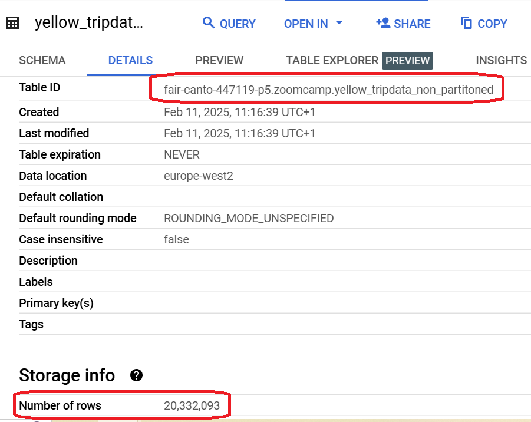
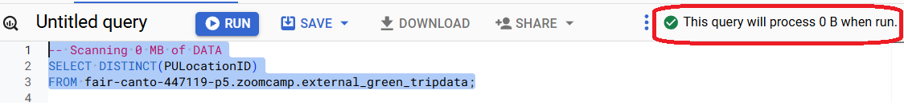
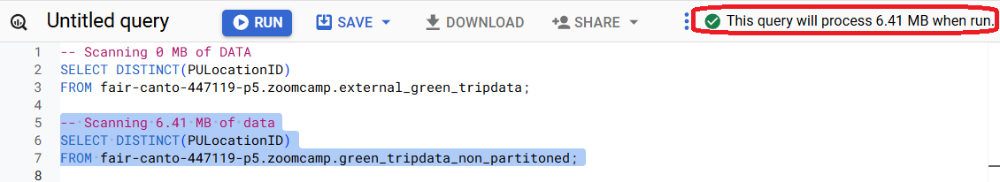
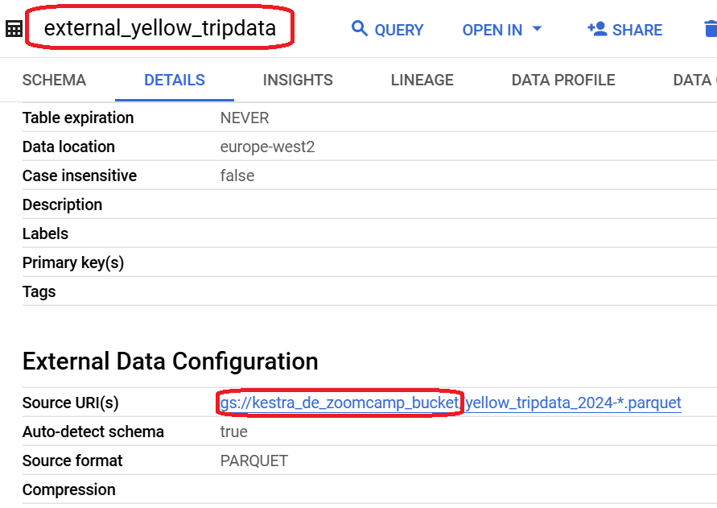

# Homework 3: Data Warehouse

## Preparations

To setup I need to create an external table using the Yellow Taxi Trip Records Data for 2024.
To do this, I manually uploaded 6 (from January to June) necessary files to the bucket (Upload -> url-links)
After that, I run in BigQuery:
```sql
-- Creating external table referring to gcs path
CREATE OR REPLACE EXTERNAL TABLE `zoomcamp.external_yellow_tripdata` 
OPTIONS ( format = 'PARQUET',
      uris = ['gs://kestra_de_zoomcamp_bucket/yellow_tripdata_2024-*.parquet']
);
```

To create a table in BQ using the Yellow Taxi Trip Records for 2024 (do not partition or cluster this table) I need to run the following query:
```sql
CREATE OR REPLACE TABLE fair-canto-447119-p5.zoomcamp.yellow_tripdata_non_partitoned AS
SELECT * FROM fair-canto-447119-p5.zoomcamp.external_yellow_tripdata;
```

## Question 1
What is count of records for the 2024 Yellow Taxi Data?
- 65,623
- 840,402
- 20,332,093
- 85,431,289

### Solution 1
In BigQuery I execute the following query:
```sql
select count(*) from zoomcamp.external_yellow_tripdata
```
and the answer is
```	
+---+----------+
|Row|    f0_   |
+---+----------+
| 1 | 20332093 |
+---+----------+
```

### Solution 2
I can find this info in the details of table `yellow_tripdata_non_partitioned` that I created before.



## Question 2
Write a query to count the distinct number of PULocationIDs for the entire dataset on both the tables.
What is the estimated amount of data that will be read when this query is executed on the External Table and the Table?

- 18.82 MB for the External Table and 47.60 MB for the Materialized Table
- 0 MB for the External Table and 155.12 MB for the Materialized Table
- 2.14 GB for the External Table and 0MB for the Materialized Table
- 0 MB for the External Table and 0MB for the Materialized Table

### Solution
I need to highlight two following queries and look which responce I'll get:
```sql
SELECT DISTINCT(PULocationID)
FROM fair-canto-447119-p5.zoomcamp.external_yellow_tripdata;
```
and the result for external table is


and
```sql
SELECT DISTINCT(PULocationID)
FROM fair-canto-447119-p5.zoomcamp.yellow_tripdata_non_partitoned;
```
and the result for materialized table is


## Question 3
Write a query to retrieve the PULocationID from the table (not the external table) in BigQuery. Now write a query to retrieve the PULocationID and DOLocationID on the same table. Why are the estimated number of Bytes different?

- BigQuery is a columnar database, and it only scans the specific columns requested in the query. Querying two columns (PULocationID, DOLocationID) requires reading more data than querying one column (PULocationID), leading to a higher estimated number of bytes processed.
- BigQuery duplicates data across multiple storage partitions, so selecting two columns instead of one requires scanning the table twice, doubling the estimated bytes processed.
- BigQuery automatically caches the first queried column, so adding a second column increases processing time but does not affect the estimated bytes scanned.
- When selecting multiple columns, BigQuery performs an implicit join operation between them, increasing the estimated bytes processed
### Solution
I execute the following requests:
```sql
-- 155.12 MB
SELECT PULocationID  
FROM fair-canto-447119-p5.zoomcamp.yellow_tripdata_non_partitoned;  

-- 310.24 MB
SELECT PULocationID, DOLocationID  
FROM fair-canto-447119-p5.zoomcamp.yellow_tripdata_non_partitoned; 
```
as we can see, the retrieving of two columns requieres in two times more Bytes for extimation. The reason and the right answer is because `BigQuery is a columnar database, and it only scans the specific columns requested in the query. Querying two columns (PULocationID, DOLocationID) requires reading more data than querying one column (PULocationID), leading to a higher estimated number of bytes processed.`

## Question 4
How many records have a fare_amount of 0?
- 128,210
- 546,578
- 20,188,016
- 8,333

### Solution
I need to execute the following query in any created here table:
```sql
SELECT count(*)
FROM fair-canto-447119-p5.zoomcamp.yellow_tripdata_non_partitoned
where fare_amount=0;
```
and the answer is
```	
+---+------+
|Row| f0_  |
+---+------+
| 1 | 8333 |
+---+------+
```

## Question 5
What is the best strategy to make an optimized table in Big Query if your query will always filter based on tpep_dropoff_datetime and order the results by VendorID (Create a new table with this strategy)

- Partition by tpep_dropoff_datetime and Cluster on VendorID
- Cluster on by tpep_dropoff_datetime and Cluster on VendorID
- Cluster on tpep_dropoff_datetime Partition by VendorID
- Partition by tpep_dropoff_datetime and Partition by VendorID

### Solution
I try to create the tables by each strategy and compare it.

```sql
-- Creating a partition by tpep_dropoff_datetime and cluster on VendorID
CREATE OR REPLACE TABLE fair-canto-447119-p5.zoomcamp.yellow_tripdata_41
PARTITION BY DATE(tpep_dropoff_datetime) 
CLUSTER BY VendorID AS
SELECT * FROM fair-canto-447119-p5.zoomcamp.yellow_tripdata_non_partitoned;

-- Creating a cluster on by tpep_dropoff_datetime and cluster on VendorID
CREATE OR REPLACE TABLE fair-canto-447119-p5.zoomcamp.yellow_tripdata_42
cluster BY tpep_dropoff_datetime, VendorID AS
SELECT * FROM fair-canto-447119-p5.zoomcamp.yellow_tripdata_non_partitoned;

-- Creating a сluster on tpep_dropoff_datetime and partition by VendorID
-- In BigQuery, partitioning by `VendorID` is not directly possible, as partitioning only supports dates, numeric ranges, and ingestion time. However, if `VendorID` is a numeric identifier, **Integer Range Partitioning** can be used.
CREATE OR REPLACE TABLE fair-canto-447119-p5.zoomcamp.yellow_tripdata_43
PARTITION BY RANGE_BUCKET(VendorID, GENERATE_ARRAY(0, 10000, 100)) 
CLUSTER BY tpep_dropoff_datetime AS
SELECT * FROM fair-canto-447119-p5.zoomcamp.yellow_tripdata_non_partitoned;

-- Creating a partition by tpep_dropoff_datetime and partition by VendorID
-- We can only partition a table by one column at a time, so the following query is inpossible
CREATE OR REPLACE TABLE fair-canto-447119-p5.zoomcamp.yellow_tripdata_44
PARTITION BY DATE(tpep_dropoff_datetime) and VendorID AS
SELECT * FROM fair-canto-447119-p5.zoomcamp.yellow_tripdata_non_partitoned;
```
Here I checked the estimated amount of data is processed for each created table:
```sql
-- Query scans 132.49 MB
SELECT count(*) as trips
FROM fair-canto-447119-p5.zoomcamp.yellow_tripdata_41
where VendorID=1;

-- Query scans 155.12 KB
SELECT count(*) as trips
FROM fair-canto-447119-p5.zoomcamp.yellow_tripdata_42
where VendorID=1;

-- Query scans 155.12 MB
SELECT count(*) as trips
FROM fair-canto-447119-p5.zoomcamp.yellow_tripdata_43
where VendorID=1;
```
So, the best strategy is `Partition by tpep_dropoff_datetime Cluster on VendorID`


## Question 6
Write a query to retrieve the distinct VendorIDs between tpep_dropoff_datetime 2024-03-01 and 2024-03-15 (inclusive)
Use the materialized table you created earlier in your from clause and note the estimated bytes. Now change the table in the from clause to the partitioned table you created for question 5 and note the estimated bytes processed. What are these values?

Choose the answer which most closely matches.

- 12.47 MB for non-partitioned table and 326.42 MB for the partitioned table
- 310.24 MB for non-partitioned table and 26.84 MB for the partitioned table
- 5.87 MB for non-partitioned table and 0 MB for the partitioned table
- 310.31 MB for non-partitioned table and 285.64 MB for the partitioned table

### Solution
I need to execute the following queries:
```sql
-- 310.24 MB
SELECT DISTINCT(VendorID)
FROM fair-canto-447119-p5.zoomcamp.yellow_tripdata_non_partitoned
WHERE DATE(tpep_dropoff_datetime) BETWEEN '2024-03-01' AND '2024-03-15';

-- 26.84 MB
SELECT DISTINCT(VendorID)
FROM fair-canto-447119-p5.zoomcamp.yellow_tripdata_41
WHERE DATE(tpep_dropoff_datetime) BETWEEN '2024-03-01' AND '2024-03-15';
```
As a result, I can say that `310.24 MB for non-partitioned table and 26.84 MB for the partitioned table` is the right answer.

## Question 7
Where is the data stored in the External Table you created?

- Big Query
- GCP Bucket
- Big Table
- Container Registry

### Solution
The answer can be found in the details of table:


So, the answer is `GCP Bucket`

## Question 8
It is best practice in Big Query to always cluster your data:

- True
- False

### Solution
The answer is `False` 

Clustering in BigQuery is not always necessary and should be used strategically based on query patterns and dataset characteristics. While clustering improves query performance by organizing data based on selected columns, it also introduces some trade-offs.  

When Clustering is Not Needed:
- Your dataset is small (clustering won’t provide significant benefits).  
- Your queries are highly random (no clear patterns in filtering).  
- Your columns have extremely high cardinality (e.g., unique UUIDs for each row).  
- You're already using partitioning effectively (partitioning might be enough).  


