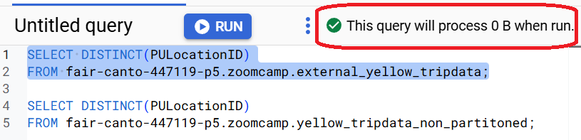
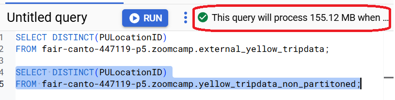

# Homework 3: Data Warehouse

## Preparations

To setup I need to create an external table using the Green Taxi Trip Records Data for 2022.
To do this, I manually uploaded 12 necessary files to the bucket (Upload -> url-links)
After that, I run in BigQuery:
```sql
-- Creating external table referring to gcs path
CREATE OR REPLACE EXTERNAL TABLE `zoomcamp.external_green_tripdata` 
OPTIONS ( format = 'PARQUET',
      uris = ['gs://kestra_de_zoomcamp_bucket/green_tripdata_2022-*.parquet']
);
```

To create a table in BQ using the Green Taxi Trip Records for 2022 (do not partition or cluster this table) I need to run the following query:
```sql
CREATE OR REPLACE TABLE fair-canto-447119-p5.zoomcamp.green_tripdata_non_partitoned AS
SELECT * FROM fair-canto-447119-p5.zoomcamp.external_green_tripdata;
```

## Question 1
What is count of records for the 2022 Green Taxi Data??
- 65,623,481
- 840,402
- 1,936,423
- 253,647

### Solution 1
In BigQuery I execute the following query:
```sql
select count(*) from zoomcamp.external_green_tripdata
```
and the answer is
```	
+---+--------+
|Row|  f0_   |
+---+--------+
| 1 | 840402 |
+---+--------+
```

### Solution 2
I can find this info in the details of table `green_tripdata_non_partitioned` that I created before.


## Question 2
Write a query to count the distinct number of PULocationIDs for the entire dataset on both the tables.
What is the estimated amount of data that will be read when this query is executed on the External Table and the Table?
- 0 MB for the External Table and 6.41MB for the Materialized Table
- 18.82 MB for the External Table and 47.60 MB for the Materialized Table
- 0 MB for the External Table and 0MB for the Materialized Table
- 2.14 MB for the External Table and 0MB for the Materialized Table

### Solution
I need to highlight two following queries and look which responce I'll get:
```sql
SELECT DISTINCT(PULocationID)
FROM fair-canto-447119-p5.zoomcamp.external_green_tripdata;
```
and the result for external table is


and
```sql
SELECT DISTINCT(PULocationID)
FROM fair-canto-447119-p5.zoomcamp.green_tripdata_non_partitoned;
```
and the result for materialized table is


## Question 3
How many records have a fare_amount of 0?
- 12,488
- 128,219
- 112
- 1,622

### Solution
I need to execute the following query in any created here table:
```sql
SELECT count(*)
FROM fair-canto-447119-p5.zoomcamp.green_tripdata_non_partitoned
where fare_amount=0;
```
and the answer is
```	
+---+------+
|Row| f0_  |
+---+------+
| 1 | 1622 |
+---+------+
```

## Question 4
What is the best strategy to make an optimized table in Big Query if your query will always order the results by PUlocationID and filter based on lpep_pickup_datetime? (Create a new table with this strategy)
- Cluster on lpep_pickup_datetime Partition by PUlocationID
- Partition by lpep_pickup_datetime Cluster on PUlocationID
- Partition by lpep_pickup_datetime and Partition by PUlocationID
- Cluster on by lpep_pickup_datetime and Cluster on PUlocationID

### Solution
I try to create the tables by each strategy and compare it.

```sql
-- Creating a сluster on lpep_pickup_datetime and partition by PUlocationID
-- In BigQuery, partitioning by `id_location` is not directly possible, as partitioning only supports dates, numeric ranges, and ingestion time. However, if `id_location` is a numeric identifier, **Integer Range Partitioning** can be used.
CREATE OR REPLACE TABLE fair-canto-447119-p5.zoomcamp.green_tripdata_41
PARTITION BY RANGE_BUCKET(PUlocationID, GENERATE_ARRAY(0, 10000, 1000)) 
CLUSTER BY lpep_pickup_datetime AS
SELECT * FROM fair-canto-447119-p5.zoomcamp.green_tripdata_non_partitoned;

-- Creating a partition by lpep_pickup_datetime and cluster on PUlocationID
CREATE OR REPLACE TABLE fair-canto-447119-p5.zoomcamp.green_tripdata_42
PARTITION BY DATE(lpep_pickup_datetime) 
CLUSTER BY PUlocationID AS
SELECT * FROM fair-canto-447119-p5.zoomcamp.green_tripdata_non_partitoned;

-- Creating a partition by lpep_pickup_datetime and partition by PUlocationID
-- We can only partition a table by one column at a time, so the following query is inpossible
CREATE OR REPLACE TABLE fair-canto-447119-p5.zoomcamp.green_tripdata_43
PARTITION BY DATE(lpep_pickup_datetime) and PUlocationID AS
SELECT * FROM fair-canto-447119-p5.zoomcamp.green_tripdata_non_partitoned;

-- Creating a cluster on by lpep_pickup_datetime and cluster on PUlocationID
CREATE OR REPLACE TABLE fair-canto-447119-p5.zoomcamp.green_tripdata_44
cluster BY lpep_pickup_datetime, PUlocationID AS
SELECT * FROM fair-canto-447119-p5.zoomcamp.green_tripdata_non_partitoned;
```
Here I checked the estimated amount of data is processed for each created table:
```sql
-- Query scans 6.41 MB
SELECT count(*) as trips
FROM fair-canto-447119-p5.zoomcamp.green_tripdata_41
where PUlocationID=1;

-- Query scans 838.86 KB
SELECT count(*) as trips
FROM fair-canto-447119-p5.zoomcamp.green_tripdata_42
where PUlocationID=1;

-- Query scans 6.41 MB
SELECT count(*) as trips
FROM fair-canto-447119-p5.zoomcamp.green_tripdata_44
where PUlocationID=1;
```
So, the best strategy is `Partition by lpep_pickup_datetime Cluster on PUlocationID`


## Question 5
Write a query to retrieve the distinct PULocationID between lpep_pickup_datetime 06/01/2022 and 06/30/2022 (inclusive)

Use the materialized table you created earlier in your from clause and note the estimated bytes. Now change the table in the from clause to the partitioned table you created for question 4 and note the estimated bytes processed. What are these values?

Choose the answer which most closely matches.

- 22.82 MB for non-partitioned table and 647.87 MB for the partitioned table
- 12.82 MB for non-partitioned table and 1.12 MB for the partitioned table
- 5.63 MB for non-partitioned table and 0 MB for the partitioned table
- 10.31 MB for non-partitioned table and 10.31 MB for the partitioned table

### Solution
I need to execute the following queries:
```sql
-- 12.82 MB
SELECT DISTINCT(PULocationID)
FROM fair-canto-447119-p5.zoomcamp.green_tripdata_non_partitoned
WHERE DATE(lpep_pickup_datetime) BETWEEN '2022-06-01' AND '2022-06-30';

-- 1.12 MB
SELECT DISTINCT(PULocationID)
FROM fair-canto-447119-p5.zoomcamp.green_tripdata_42
WHERE DATE(lpep_pickup_datetime) BETWEEN '2022-06-01' AND '2022-06-30';
```
As a result, I can say that `12.82 MB for non-partitioned table and 1.12 MB for the partitioned table` is the right answer.

## Question 6
Where is the data stored in the External Table you created?

- Big Query
- GCP Bucket
- Big Table
- Container Registry

### Solution
The answer can be found in the details of table:


So, the answer is `GCP Bucket`

## Question 7
It is best practice in Big Query to always cluster your data:

- True
- False

### Solution
The answer is **False** 

Clustering in BigQuery **is not always necessary** and should be used strategically based on query patterns and dataset characteristics. While clustering **improves query performance** by organizing data based on selected columns, it also introduces some trade-offs.  

**When Clustering is Not Needed**  
- Your dataset is small (clustering won’t provide significant benefits).  
- Your queries are **highly random** (no clear patterns in filtering).  
- Your columns have **extremely high cardinality** (e.g., unique UUIDs for each row).  
- You're already **using partitioning effectively** (partitioning might be enough).  


